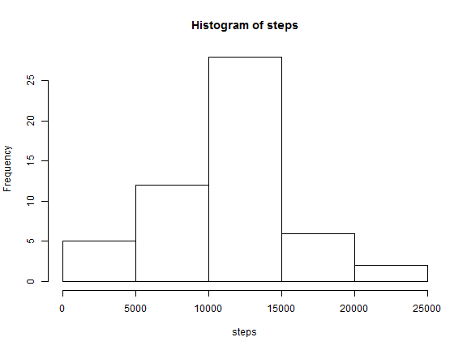
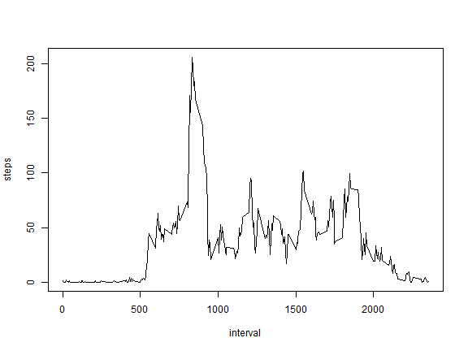
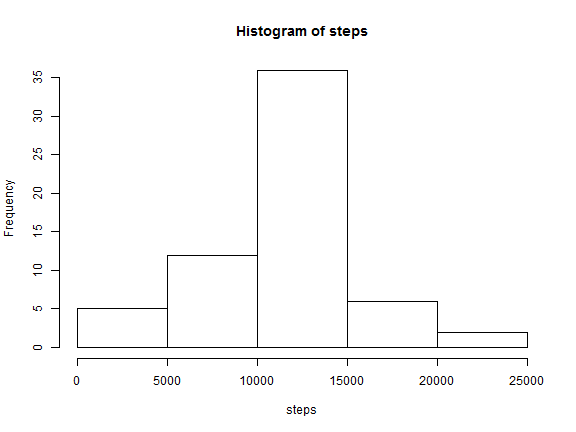
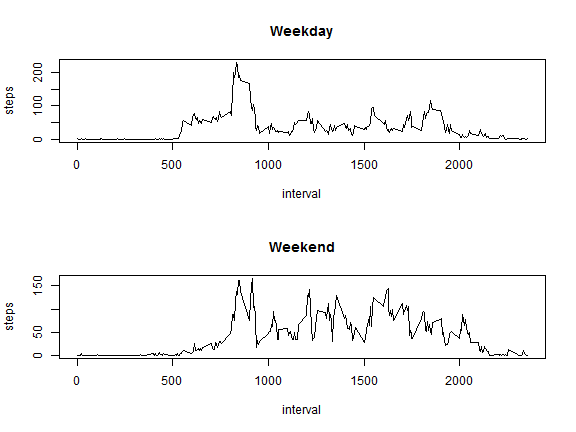

##Reproducible Research Peer Review Assignment 1


###Loading and preprocessing the data
Lets first read the data from csv file and process the data to format suitable for analysis
We will use dplyr package to convert data into data table.


```r
library("dplyr",warn.conflicts=FALSE)
activity_data <- read.csv("activity.csv")
activity_data$date <- as.Date(activity_data$date)
activity_data_tbl <- tbl_df(activity_data)
```

###Mean total number of steps taken per day

Here is the histogram of the total number of steps taken each day


```r
steps_by_date <- filter(activity_data_tbl,!is.na(steps)) %>%
group_by(date) %>% summarize( steps = sum(steps))
with(steps_by_date,hist(steps))
```

 

Mean of total number of steps taken each day

```r
mean(steps_by_date$steps)
```

```
## [1] 10766.19
```
Median of total number of steps taken each day

```r
median(steps_by_date$steps)
```

```
## [1] 10765
```

###Average daily activity pattern

We calculate average number of steps taken across all days for each interval and create plot to view average daily pattern


```r
steps_by_interval <- filter(activity_data_tbl,!is.na(steps)) %>%
                     group_by(interval) %>%
                     summarize( steps = mean(steps)) 

with(steps_by_interval,plot(interval,steps,type="l"))
```

 

Let find out Which time inverval on average across all data has maximum steps


```r
steps_by_interval$interval[which.max(steps_by_interval$steps)]
```

```
## [1] 835
```

###Input missing values

Number of missing values in dataset is

```r
empty_data <- filter(activity_data_tbl,is.na(steps))
length(empty_data$steps)
```

```
## [1] 2304
```

We will need to fill missing values in the dataset. To fill missing values we will use mean for that 5-minute interval across all days.


```r
hours <- as.integer(empty_data$interval/100)
mins  <- empty_data$interval %% 100
rec_num <-  (hours * 12) + (mins/5) + 1
empty_data$steps <- steps_by_interval$steps[rec_num] 
```

Now we will merge two datasets one with original data without missing values and another with missing values filled in by mean for that 5-minute interval


```r
act_dat_tbl <- filter(activity_data_tbl,!is.na(steps))
act_full_data <- rbind(empty_data,act_dat_tbl)
```

Now we will plot histogram of the total number of steps taken each day with new completed dataset


```r
steps_full_by_date <- filter(act_full_data,!is.na(steps)) %>%
group_by(date) %>% summarize( steps = sum(steps))
with(steps_full_by_date,hist(steps))
```

 


Mean of steps taken each day

```r
mean(steps_full_by_date$steps)
```

```
## [1] 10766.19
```
Median of steps taken each day

```r
median(steps_full_by_date$steps)
```

```
## [1] 10766.19
```

As you can see mean and median remain almost the same so adding missing data does not have much impact on our analysis although there are some changes in histogram frequency of steps taken between 10000 to 15000 have increased from 30 to 35

###Differences in activity patterns between weekdays and weekends
For this analysis we will create new factor variable in the dataset with two levels - "weekday" and "weekend" indicating whether a given date is a weekday or weekend day.

```r
weekday <- c("Monday","Tuesday","Wednesday","Thursday","Friday")
is_weekday <- weekdays(act_full_data$date) %in% weekday
for (n in 1:length(is_weekday)) { 
  if(is_weekday[n]) {act_full_data$day_type[n] <- "weekday"} 
  else{ act_full_data$day_type[n] <- 'weekend' }
}
```
Lets Make a panel plot containing a time series plot of the 5-minute interval (x-axis) and the average number of steps taken, averaged across all weekday days or weekend days (y-axis).


```r
act_full_by_day_type <- group_by(act_full_data,day_type,interval) %>% 
                        summarize( steps = mean(steps))
par(mfrow=c(2,1))
weekday <- filter(act_full_by_day_type,day_type=="weekday")
weekend <- filter(act_full_by_day_type,day_type=="weekend")
with(weekday,plot(interval,steps,type="l",main="Weekday"))
with(weekend,plot(interval,steps,type="l",main="Weekend"))
```

 

As you can see from  plots above that there are some differences in average steps during weekend v.s. weekdays looks like on weekdays lot of activity is seen between 5.00 am to 10 am and the activity slows down after 10 am whearas on weekends activity start after 8.00 am and remains pretty much throughout day until 9.00 pm
